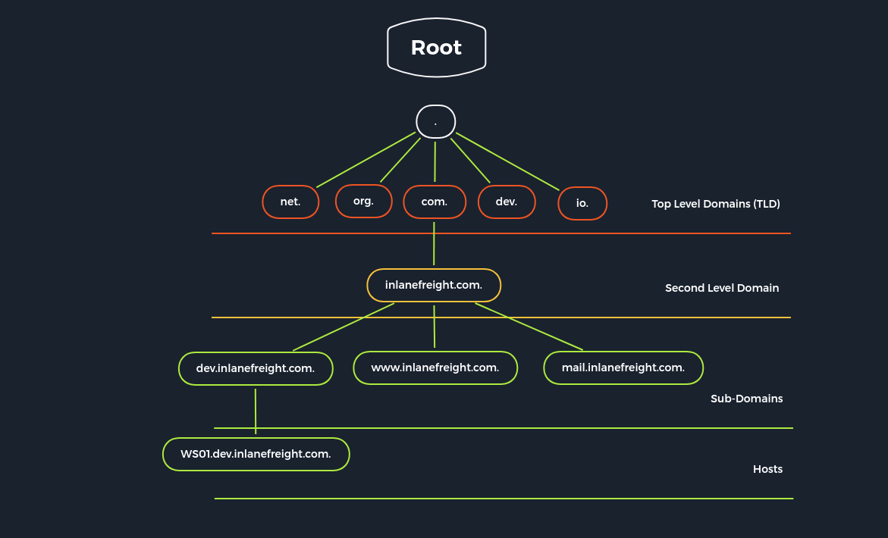

# Domain Name System (DNS):

DNS translates domain names (e.g., [www.hackthebox.com](http://www.hackthebox.com)) into IP addresses. It's decentralized, with global servers like root servers, authoritative servers, and caching servers to manage the process. Types of DNS servers include:

- **DNS root server**
- **Authoritative name server**
- **Non-authoritative name server**
- **Caching server**
- **Forwarding server**
- **Resolver**

| **Server Type** | **Description** |
| --- | --- |
| DNS Root Server | Manages TLDs; 13 root servers globally; coordinates by ICANN. |
| Authoritative Nameserver | Holds authority for a DNS zone, responds with binding information. |
| Non-authoritative Nameserver | Collects DNS info using recursive/iterative queries, not directly responsible. |
| Caching DNS Server | Caches DNS info from other servers for a set period, duration defined by authority. |
| Forwarding Server | Forwards DNS queries to another DNS server. |
| Resolver | Resolves DNS names locally on a computer/router, not authoritative. |

&nbsp;

* * *

### DNS Records

| **DNS Record** | **Description** |
| --- | --- |
| `A` | Returns an IPv4 address of the requested domain as a result. |
| `AAAA` | Returns an IPv6 address of the requested domain. |
| `MX` | Returns the responsible mail servers as a result. |
| `NS` | Returns the DNS servers (nameservers) of the domain. |
| `TXT` | This record can contain various information. The all-rounder can be used, e.g., to validate the Google Search Console or validate SSL certificates. In addition, SPF and DMARC entries are set to validate mail traffic and protect it from spam. |
| `CNAME` | This record serves as an alias for another domain name. If you want the domain www.hackthebox.eu to point to the same IP as hackthebox.eu, you would create an A record for hackthebox.eu and a CNAME record for www.hackthebox.eu. |
| `PTR` | The PTR record works the other way around (reverse lookup). It converts IP addresses into valid domain names. |
| `SOA` | Provides information about the corresponding DNS zone and email address of the administrative contact. |

* * *

### DNS (SOA Command) (SOA-Start Of Authority)

`dig soa www.inlanefreight.com`

* * *

### Default Configuration

- **DNS Configuration Files**:
    
    - **Local DNS Configuration Files**: Manage general settings and zone configurations.
        - **named.conf**: Main configuration file for Bind9.
            - **named.conf.local**: Custom local settings.
            - **named.conf.options**: Configuration of global server options.
            - **named.conf.log**: Log file settings.
    - **Zone Files**: Contain data for specific domains and zones.
    - **Reverse Name Resolution Files**: Used for reverse DNS lookups.
- **Types of Options**:
    
    - **Global Options**: Apply to all zones.
    - **Zone-Specific Options**: Only affect the specific zone they're assigned to. Zone options override global options if both are set.

* * *

### Local DNS Configuration

`cat /etc/bind/named.conf.local`

* * *

### Zone Files

`cat /etc/bind/db.domain.com`

* * *

### Reverse Name Resolution Zone Files

`cat /etc/bind/db.10.129.14`

* * *

## Dangerous Settings

* * *

| **Option** | **Description** |
| --- | --- |
| `allow-query` | Defines which hosts are allowed to send requests to the DNS server. |
| `allow-recursion` | Defines which hosts are allowed to send recursive requests to the DNS server. |
| `allow-transfer` | Defines which hosts are allowed to receive zone transfers from the DNS server. |
| `zone-statistics` | Collects statistical data of zones. |

* * *

## Footprinting the Service

* * *

### DIG - NS Query

`dig ns inlanefreight.htb @10.129.14.128`

* * *

### DIG - Version Query

`dig CH TXT version.bind 10.129.120.85`

* * *

### DIG - ANY Query

`dig any inlanefreight.htb @10.129.14.128`

* * *

### DIG - AXFR Zone Transfer (AXFR- Asynchronous Full Transfer Zone)

`dig axfr inlanefreight.htb @10.129.14.128`

* * *

### DIG - AXFR Zone Transfer - Internal

`dig axfr internal.inlanefreight.htb @10.129.14.128`

* * *

### Subdomain Brute Forcing

`for sub in $(cat /opt/useful/seclists/Discovery/DNS/subdomains-top1million-110000.txt);do dig $sub.inlanefreight.htb @10.129.14.128 | grep -v ';\|SOA' | sed -r '/^\s*$/d' | grep $sub | tee -a subdomains.txt;done`

* * *

### DNSenum

`dnsenum --dnsserver 10.129.14.128 --enum -p 0 -s 0 -o subdomains.txt -f /opt/useful/seclists/Discovery/DNS/subdomains-top1million-110000.txt inlanefreight.htb`

* * *
