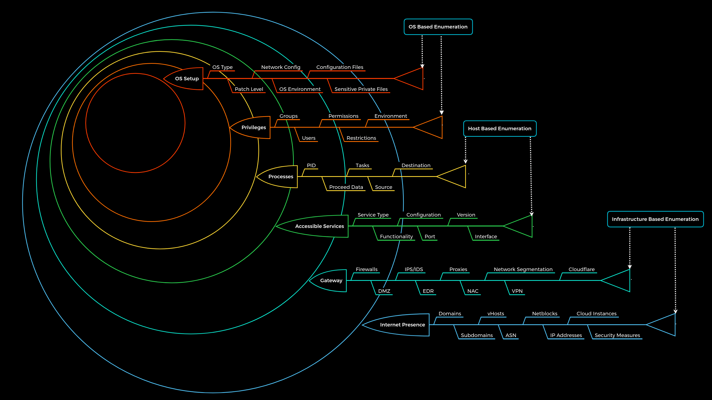

# Enumeration Principle

**Enumeration**: Information gathering using active (scans) and passive (third-party) methods. Unlike OSINT, which is purely passive, enumeration is an active loop of gathering and refining data.

**Goal**: Understand the company's infrastructure, services, and protocols, not just brute-force entry points. The key is to map out the environment before trying to exploit vulnerabilities.

**Principles of Enumeration**:

1.  **There’s more than meets the eye**: Always consider all perspectives.
2.  **What we see vs. what we don’t**: Focus on both visible and hidden elements.
3.  **There are always ways to gain more info**: Deeply understand the target.

**Questions to guide enumeration**:

- What can we see? Why?
- What does it reveal? What can we use it for?
- What can't we see? Why?
- What does it imply, and how can we exploit it?

The goal is to gather knowledge, not just exploit.

| `Infrastructure-based enumeration` | `Host-based enumeration` | `OS-based enumeration` |
| --- | --- | --- |

**Note**: The layers represent main categories, not a complete list of components to search for. The **Internet Presence** and **Gateway** layers don't apply to internal networks like **Active Directory** infrastructure. Internal infrastructure layers will be covered in other modules.

* * *

These layers are designed as follows:

| **Layer** | **Description** | **Information Categories** |
| --- | --- | --- |
| `1. Internet Presence` | Identification of internet presence and externally accessible infrastructure. | Domains, Subdomains, vHosts, ASN, Netblocks, IP Addresses, Cloud Instances, Security Measures |
| `2. Gateway` | Identify the possible security measures to protect the company's external and internal infrastructure. | Firewalls, DMZ, IPS/IDS, EDR, Proxies, NAC, Network Segmentation, VPN, Cloudflare |
| `3. Accessible Services` | Identify accessible interfaces and services that are hosted externally or internally. | Service Type, Functionality, Configuration, Port, Version, Interface |
| `4. Processes` | Identify the internal processes, sources, and destinations associated with the services. | PID, Processed Data, Tasks, Source, Destination |
| `5. Privileges` | Identification of the internal permissions and privileges to the accessible services. | Groups, Users, Permissions, Restrictions, Environment |
| `6. OS Setup` | Identification of the internal components and systems setup. | OS Type, Patch Level, Network config, OS Environment, Configuration files, sensitive private files |

* * *

**Layer 1: Internet Presence**  
Focus on identifying all target systems and interfaces visible on the Internet (domains, subdomains, netblocks). This is crucial for broader scopes, where additional hosts may be explored.

**Layer 2: Gateway**  
Understand the reachable target’s interface, protection, and network placement. This layer helps assess what you're dealing with and potential concerns.

**Layer 3: Accessible Services**  
Examine services offered by the target. Understanding each service’s purpose and functionality is key to effective communication and exploitation. This is the focus of the current module.

**Layer 4: Processes**  
Processes handle tasks with defined sources and targets. Understanding process dependencies is vital for identifying system interactions.

**Layer 5: Privileges**  
Services run under specific user permissions. Identifying and understanding privileges, especially in environments like Active Directory, reveals overlooked opportunities for exploitation.

**Layer 6: OS Setup**  
Collect information on the operating system and its configuration, reflecting internal security and administrative practices. This helps understand system management and potential vulnerabilities.

* * *

&nbsp;
