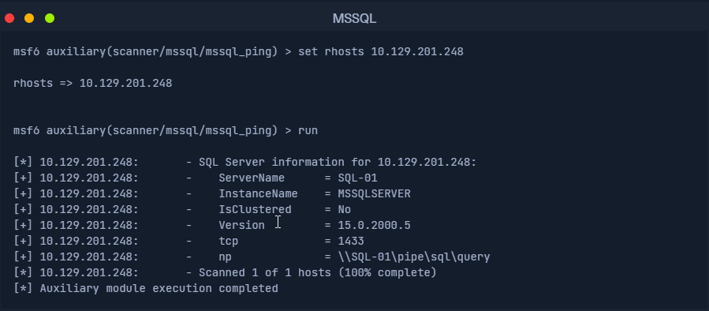

# Microsoft SQL (MSSQL) Overview

Microsoft SQL Server (**MSSQL**) is a closed-source relational database management system developed by Microsoft. It is commonly used in enterprise environments, especially in combination with **Windows OS** and **.NET framework** applications. MSSQL is more likely to be found in **Windows-based infrastructure**, though versions now support **Linux** and **macOS**.

### Ports Used:

- TCP 1433 → Default port for MSSQL server
- UDP 1434 → SQL Server Browser service

* * *

## Common Clients (Used by Admins & Pentesters):

* * *

| Tool | Type | Notes |
| --- | --- | --- |
| SSMS (SQL Server Mgmt Studio) | GUI | Official Microsoft client; used for configuration and management |
| mssql-cli | CLI | Interactive command-line tool for querying MSSQL |
| PowerShell | CLI | Uses `Invoke-Sqlcmd`; scriptable and automation-friendly |
| HeidiSQL / SQLPro | GUI | Lightweight third-party MSSQL clients |
| Impacket's mssqlclient.py | CLI | Pentester-friendly; part of Impacket toolkit, useful for auth bypass |

* * *

## Default System Databases:

* * *

| Database | Description |
| --- | --- |
| master | Tracks all system-level configuration and login info |
| model | Template used for every new database |
| msdb | Used by SQL Server Agent for job scheduling, alerts, and automation |
| tempdb | Temporary storage for transient or session-scoped data |
| resource | Read-only; holds internal system objects like tables and procedures |

* * *

## Default Configuration:

* * *

| Setting | Value / Behavior |
| --- | --- |
| Service User | NT SERVICE\\MSSQLSERVER |
| Authentication Mode | Windows Authentication (SAM or Active Directory) |
| Encryption | Not enforced by default |
| SQL Browser Service | Enabled; listens on UDP 1434 |
| Named Pipes | Often enabled for legacy local communication |
| Port (TCP) | 1433 |
| sa Account | Enabled by default; may have weak/default password |

**Windows Authentication**: Auth requests are processed via:

- **Local SAM** (Standalone system)
    
- **Active Directory** (Domain joined systems)
    

If domain credentials are compromised, it could lead to **lateral movement** and **privilege escalation** in Windows environments.

* * *

## Dangerous Settings / Misconfigurations:

* * *

| Setting / Behavior | Risk / Description |
| --- | --- |
| No Encryption on Connections | Cleartext credentials and queries; vulnerable to sniffing |
| Self-Signed Certificates | Easily spoofed; attacker can MITM encrypted traffic |
| Named Pipes | May allow privilege escalation or impersonation |
| Weak / Default sa Password | Full access if not changed or disabled |
| Saved SSMS Credentials | Exposed credentials if host is compromised |
| AD-only Authentication | AD compromise = MSSQL compromise |

* * *

## Footprinting the Service

* * *

#### NMAP MSSQL Script Scan

`sudo nmap --script ms-sql-info,ms-sql-empty-password,ms-sql-xp-cmdshell,ms-sql-config,ms-sql-ntlm-info,ms-sql-tables,ms-sql-hasdbaccess,ms-sql-dac,ms-sql-dump-hashes --script-args mssql.instance-port=1433,mssql.username=sa,mssql.password=,mssql.instance-name=MSSQLSERVER -sV -p 1433 10.129.201.248`

* * *

#### MSSQL Ping in Metasploit

* * *

#### Connecting with Mssqlclient.py

`python3 mssqlclient.py Administrator@10.129.201.248 -windows-auth`

* * *

&nbsp;