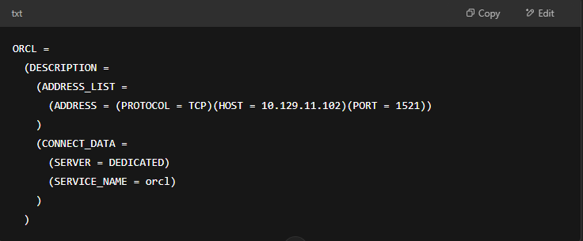
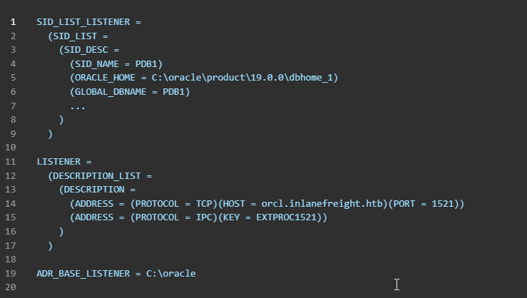

# Oracle TNS (Transparent Network Substrate) Overview

- Oracle TNS is a **communication protocol** for Oracle DB and applications.
    
- Part of **Oracle Net Services**.
    
- Supports multiple protocols: **IPX/SPX**, **TCP/IP**, **UDP**, **AppleTalk**.
    
- Widely used in **healthcare**, **finance**, and **retail** industries.
    

&nbsp;

### Key Features

- **Encryption** for secure transmission.
    
- Supports **IPv6**, **SSL/TLS**.
    
- Used for:
    
    - Name resolution
        
    - Connection management
        
    - Load balancing
        
    - Security
        
- Used Port:
    
    - TCP 1521 → Default port used for Oracle TNS

* * *

## Default Configuration

* * *

| Setting | Default Value / Notes |
| --- | --- |
| Default Port | TCP/1521 |
| Listener File | listener.ora |
| Client Config | tnsnames.ora |
| Config Path | $ORACLE_HOME/network/admin |
| Remote Mgmt | Enabled in 8i/9i, disabled in 10g/11g |
| Auth Mechanism | Hostnames, IPs, Usernames, Passwords |
| Protocols | TCP/IP, UDP, IPX/SPX, AppleTalk |

* * *

## Config Files

* * *

### `tnsnames.ora` (Client-side)



* * *

### `listener.ora` (Server-side)



* * *

### Security Considerations

- **Built-in encryption** over TCP/IP.
    
- Listener restricts unauthorized access.
    
- Uses **Oracle Net Services** encryption.
    

&nbsp;

### Weak Defaults (Older Versions)

- Oracle 9: `CHANGE_ON_INSTALL`
    
- DBSNMP default user: `dbsnmp`
    
- Oracle 10: No default password
    

&nbsp;

### Legacy Risks

Use of `finger` service with Oracle exposes user info (e.g., home dirs).

* * *

## PL/SQL Exclusion List

* * *

- File placed at: `$ORACLE_HOME/sqldeveloper`
    
- Purpose: **Block execution** of specific packages/types.
    
- Acts as a **blacklist** from Oracle App Server.
    

* * *

## Common TNS Settings (Cheat Table)

* * *

| Setting | Description |
| --- | --- |
| DESCRIPTION | Defines DB name and type |
| ADDRESS | Hostname + Port |
| PROTOCOL | Communication Protocol |
| PORT | DB Port (default: 1521) |
| CONNECT_DATA | Attributes like SID/SERVICE_NAME |
| INSTANCE_NAME | DB instance name |
| SERVICE_NAME | DB service name |
| SERVER | Connection type (DEDICATED/SHARED) |
| USER, PASSWORD | Auth credentials |
| SECURITY | SSL/TLS options |
| VALIDATE_CERT | Validate server cert |
| SSL_VERSION | SSL/TLS version |
| CONNECT_TIMEOUT | Client connection timeout |
| RECEIVE_TIMEOUT | Response timeout |
| SEND_TIMEOUT | Request timeout |
| SQLNET.EXPIRE_TIME | Detect failed conn timeout |
| TRACE_LEVEL | Trace verbosity |
| TRACE_DIRECTORY | Trace file location |
| TRACE_FILE_NAME | Trace file name |
| LOG_FILE | Log file path |

* * *

## Footprinting the Service

* * *

#### Sqlplus Commands: [SQLplus commands](https://docs.oracle.com/cd/E11882_01/server.112/e41085/sqlqraa001.htm#SQLQR985)

* * *

#### Oracle-Tools-setup.sh

```bash
#!/bin/bash

sudo apt-get install libaio1 python3-dev alien -y
git clone https://github.com/quentinhardy/odat.git
cd odat/
git submodule init
git submodule update
wget https://download.oracle.com/otn_software/linux/instantclient/2112000/instantclient-basic-linux.x64-21.12.0.0.0dbru.zip
unzip instantclient-basic-linux.x64-21.12.0.0.0dbru.zip
wget https://download.oracle.com/otn_software/linux/instantclient/2112000/instantclient-sqlplus-linux.x64-21.12.0.0.0dbru.zip
unzip instantclient-sqlplus-linux.x64-21.12.0.0.0dbru.zip
export LD_LIBRARY_PATH=instantclient_21_12:$LD_LIBRARY_PATH
export PATH=$LD_LIBRARY_PATH:$PATH
pip3 install cx_Oracle
sudo apt-get install python3-scapy -y
sudo pip3 install colorlog termcolor passlib python-libnmap
sudo apt-get install build-essential libgmp-dev -y
pip3 install pycryptodome
```

* * *

#### Nmap

`sudo nmap -p1521 -sV 10.129.204.235 --open`

* * *

#### Nmap - SID Bruteforcing

`sudo nmap -p1521 -sV 10.129.204.235 --open --script oracle-sid-brute`

* * *

#### ODAT

`./odat.py all -s 10.129.204.235`

* * *

#### SQLplus - Log In

`sqlplus scott/tiger@10.129.204.235/XE`

* * *

#### Oracle RDBMS - Database Enumeration

`sqlplus scott/tiger@10.129.204.235/XE as sysdba`

* * *

#### Oracle RDBMS - File Upload

`echo "Oracle File Upload Test" > testing.txt`

`./odat.py utlfile -s 10.129.204.235 -d XE -U scott -P tiger --sysdba --putFile C:\\inetpub\\wwwroot testing.txt ./testing.txt`

* * *

&nbsp;