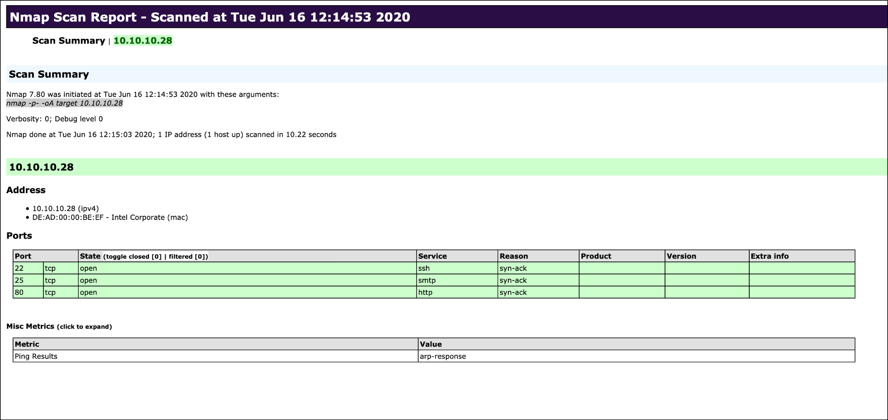

# Saving the Results

## Different Formats

Always save scan results for comparison and analysis. Nmap supports three output formats:

- **Normal output** (`-oN`) → `.nmap`
- **Grepable output** (`-oG`) → `.gnmap`
- **XML output** (`-oX`) → `.xml`

Use the `-oA` option to save Nmap scan results in **all formats** (`.nmap`, `.gnmap`, `.xml`).

* * *

### All Formats

`sudo nmap 10.129.2.28 -p- -oA target`

| **Scanning Options** | **Description** |
| --- | --- |
| `10.129.2.28` | Scans the specified target. |
| `-p-` | Scans all ports. |
| `-oA target` | Saves the results in all formats, starting the name of each file with 'target'. |

## Style sheets (HTML Report)

The **XML output (`-oX`)** allows easy conversion to **HTML reports** for clear documentation, even for non-technical users. Use **`xsltproc`** to convert XML to HTML:

`xsltproc target.xml -o target.html`

* * *

### Nmap Report

&nbsp;
